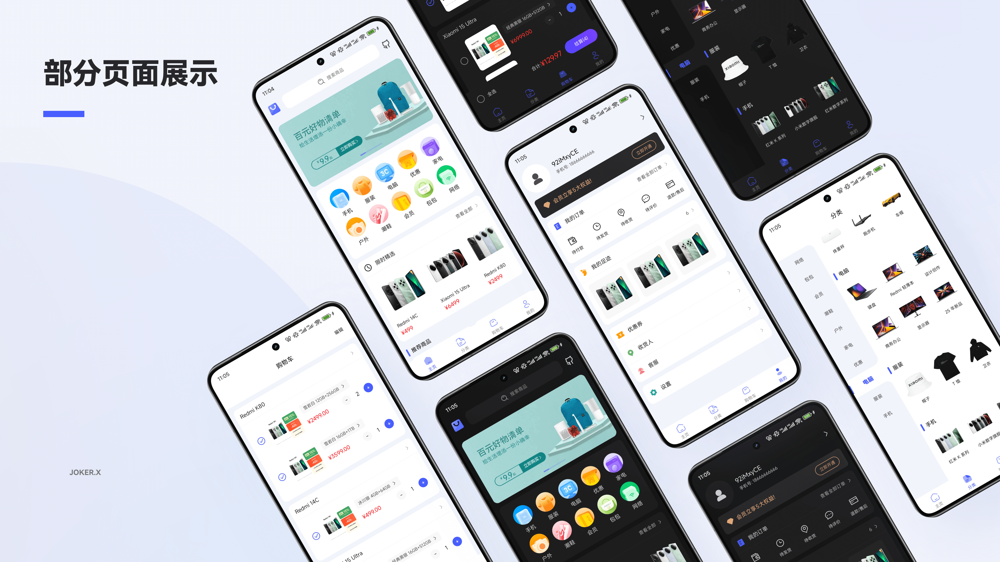

<div align="center">


# 青商城

_🛍️ 基于 Kotlin 和 Jetpack Compose 的现代化电商应用_

[](https://github.com/Joker-x-dev/CoolMallKotlin)
[](https://www.pgyer.com/CoolMallKotlinProdRelease)
[](https://coolmall.apifox.cn)

</div>

## 📖 项目简介

这是一个基于 Kotlin 和 Jetpack Compose 打造的开源电商学习项目，正在逐步完善中。项目采用了 Google 推荐的应用架构和最佳实践，参考了 [Now in Android](https://github.com/android/nowinandroid) 的架构设计，旨在展示如何运用现代 Android 开发技术构建一个电商应用的学习案例，适合开发者学习参考，而非直接用于商业环境。

作为热爱技术的个人开发者，我将工作之外的时间都投入到这个项目中。每一个功能的实现、每一次代码的优化，都是我在闲暇时间精心打磨的成果。尽管进度可能不如专职团队那么快，而且某些功能的实现还不够完善，但我会持续改进，不断完善。如果你对 Android 开发感兴趣，无论是学习还是共同创造，都欢迎加入。

## 📱 项目预览

<div align="center">

</div>

### Demo 下载

- **蒲公英下载**：[点击下载体验](https://www.pgyer.com/CoolMallKotlinProdRelease)
- **支持系统**：Android 8.0 及以上
- **更新说明**：预览版本会不定时更新，可能不会完全同步最新的代码变更

### API 文档

- **接口文档**：[在线查看](https://coolmall.apifox.cn)
- **说明**：接口文档会随着项目开发进度同步更新，主要包含各接口的请求参数和返回数据示例

## 🛠️ 技术栈

| 类别 | 技术选型 |
|------|----------|
| 编程语言 |  |
| UI 框架 |  |
| 架构模式 |  |
| 依赖注入 |  |
| 异步处理 |  |
| 导航 |  |
| 数据序列化 |  |
| 网络请求 |   |
| 图片加载 |  |
| 数据库 |  |
| 数据存储 |  |
| 日志框架 |  |
| 调试工具 |   |
| 测试框架 |  |

## ✨ 项目特点

- 采用模块化架构设计，各功能模块高度解耦
- 使用 Jetpack Compose 构建现代化 UI
- 遵循 Material Design 3 设计规范
- 支持浅色/深色主题
- 采用响应式编程范式
- 完整的测试覆盖
- 持续集成与部署

## 📱 功能模块目录

- **主模块 (main)**
  - 首页 (home)
  - 分类 (category)
  - 购物车 (cart)
  - 我的 (me)

- **认证模块 (auth)**
  - 登录主页 (login)
  - 账号密码登录 (account-login)
  - 注册页面 (register)
  - 找回密码 (reset-password)
  - 短信登录 (sms-login)

- **用户体系模块 (user)**
  - 个人中心 (profile)
  - 设置模块 (settings)
  - 收货地址列表 (address-list)
  - 收货地址详情 (address-detail)
  - 用户足迹 (footprint)

- **订单模块 (order)**
  - 订单列表 (list)
  - 确认订单 (confirm)
  - 订单详情 (detail)

- **商品模块 (goods)**
  - 商品搜索 (search)
  - 商品详情 (detail)
  - 评价系统 (comment)
  - 商品分类页面 (category)

- **营销模块 (market)**
  - 优惠券管理 (coupon)

- **客服模块 (cs)**
  - 客服聊天 (chat)

- **反馈系统 (feedback)**
  - 投诉子模块 (complain)
  - 反馈子模块 (feedback)

- **公共信息模块 (common)**
  - 关于我们 (about)
  - WebView 页面 (webview)

- **启动流程模块 (launch)**
  - 启动页 (splash)
  - 引导页 (guide)

## 项目结构

```
├── app/                   # 应用入口模块
├── build-logic/          # 构建逻辑
├── core/                 # 核心模块
│   ├── common/           # 通用工具和扩展
│   ├── data/             # 数据层
│   ├── database/         # 数据库
│   ├── datastore/        # 数据存储
│   ├── designsystem/     # 设计系统
│   ├── model/            # 数据模型
│   ├── network/          # 网络层
│   ├── ui/               # UI组件
│   └── util/             # 工具类
├── feature/              # 功能模块
│   ├── auth/             # 认证模块
│   ├── common/           # 公共功能
│   ├── goods/            # 商品模块
│   ├── launch/           # 启动模块
│   ├── main/             # 主模块
│   ├── market/           # 营销模块
│   ├── order/            # 订单模块
│   └── user/             # 用户模块
└── navigation/           # 导航模块
```

## 🚀 开发计划

这是一个纯粹由个人热情驱动的开源项目。作为一名全职开发者，我只能在工作之余的时间来维护它，每一行代码都凝聚着我下班后和周末的心血。尽管时间有限，我仍然希望通过这个项目创建一个完整的电商学习案例，它更适合作为学习参考而非商业应用，因为某些方面还未达到商业级水准。我的目标是为其他开发者提供一个学习现代 Android 开发技术的实践平台。

由于时间和精力的限制，项目的更新节奏可能不会很快，但我会坚持长期投入，一步一步地完善每个功能模块。如果你有兴趣参与贡献，无论是代码、设计还是文档方面，都将非常欢迎！

### 📱 Android 版本（当前）
- **技术栈**: Kotlin + Jetpack Compose + MVVM
- **架构特点**: 模块化设计 + Clean Architecture

### 🌟 鸿蒙版本（计划中）
- **技术栈**: ArkTS + ArkUI + MVVM
- **架构特点**: 模块化设计 + 原子化服务

### 🍎 iOS 版本（计划中）
- **技术栈**: Swift + SwiftUI + MVVM
- **架构特点**: 模块化设计 + 组件化开发

## 💡 开发理念

- **循序渐进**: 采用迭代式开发方式，每次专注于一个小功能点的完善
- **开放学习**: 及时分享开发过程中的经验和心得，帮助其他开发者学习
- **持续改进**: 根据实际使用反馈不断优化架构和代码设计

## 🎯 当前开发重点

1. 完善项目基础架构
2. 实现用户认证系统
3. 构建基础的商品展示功能
4. 优化开发文档和示例代码

## 🤝 参与贡献

欢迎感兴趣的开发者参与项目开发，无论是提交 Issue、Pull Request 还是优化文档，都可以帮助项目变得更好！